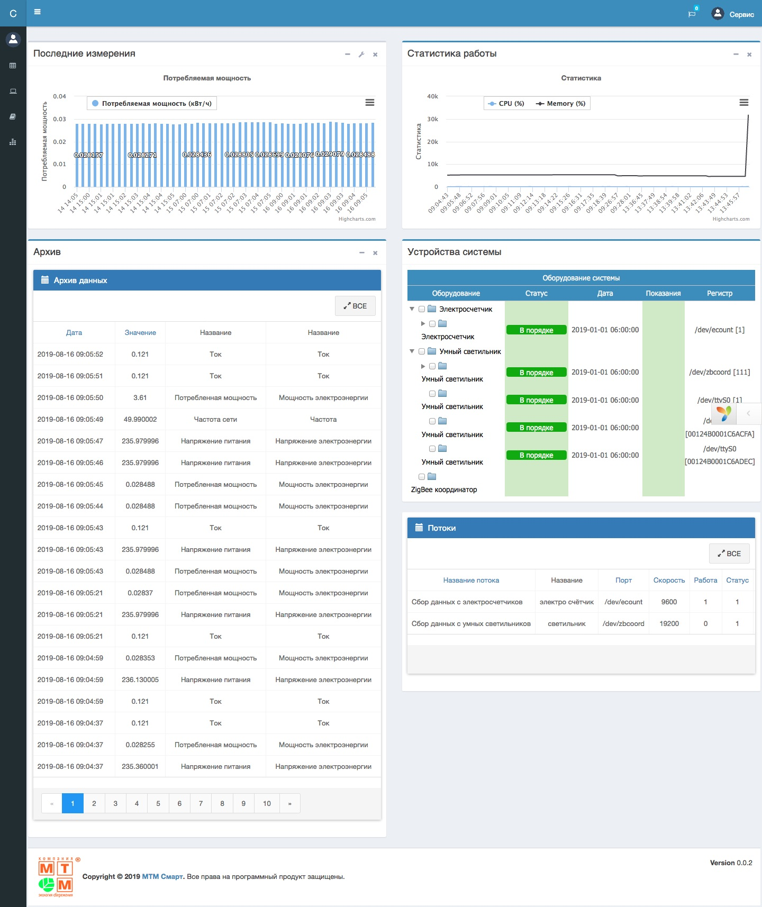
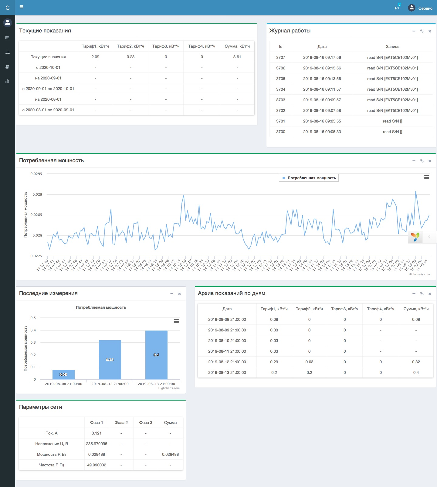
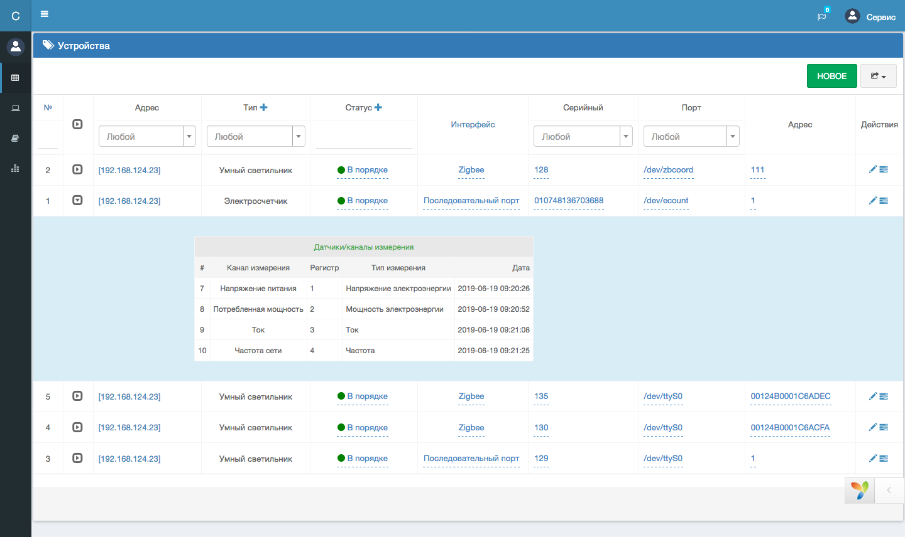

# mtm-server
Основная задача системы - управление светильниками через беспроводные модули связи и сбор данных по энергопотреблению как самих светильников, так и шкафов управления и вспомогательного оборудования в зависимости от режима работы. 
В данном репозитории находится код конфигурационного интерфейса контроллера. Код написан с использованием Yii2 framework. Конфигурационный интерфейс предназначен для конфигурации системы по месту установки.
 
Контроллер является концентратором, который собирает данные и управляет одной или несколькими линиями светильников. Также к контроллеру подключаются:
 электросчетчик, которые учитывает расход электроэнергии на все подключенное оборудование, включая сами светильники;
 видеокамеры, которые устанавливаются на объекте учета;
 контакторы, которые позволяют управлять питанием всей линии. 

